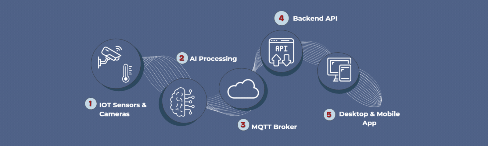

<div align="center">

# RaSed — Backend API
### Integrated Security, Safety & Monitoring System

[](https://dotnet.microsoft.com)
[](https://www.postgresql.org)
[](https://dotnet.microsoft.com/en-us/apps/aspnet/signaling)
[](https://mqtt.org)
[](https://firebase.google.com/docs/cloud-messaging)
[](https://cloudinary.com)
[](https://documenter.getpostman.com/view/38147709/2sB3WqtfUf)

---

</div>

## 📌 Overview

This repository contains the **backend API** for the RaSed system — a .NET 9 REST API
that serves as the central nervous system of the platform, bridging IoT sensor data,
AI-powered detections, and real-time communication across both mobile and desktop clients.

The API handles all business logic and data persistence, maintains a persistent connection
with the MQTT broker to receive and process live sensor events, integrates with AI detection
services for automated threat analysis, exposes SignalR hubs for real-time data streaming,
and delivers push notifications via Firebase Cloud Messaging.

---

## 🏗️ System Architecture

<div align="center">
  
</div>

---

## 📋 Table of Contents

| # | Section |
|---|---|
| 1 | [📌 Overview](#-overview) |
| 2 | [🏗️ System Architecture](#-system-architecture) |
| 3 | [⚙️ Prerequisites](#-prerequisites) |
| 4 | [🚀 Getting Started](#-getting-started) |
| 5 | [🔐 Environment Variables](#-environment-variables) |
| 6 | [🛡️ Authentication & Authorization](#-authentication--authorization) |
| 7 | [📐 System Design](#-system-design) |
| 8 | [📖 API Documentation](#-api-documentation) |
| 9 | [🗂️ Project Structure](#-project-structure) |
| 10 | [🧱 Tech Stack](#-tech-stack) |
| 11 | [👥 Meet the Team](#-meet-the-team) |

---

## ⚙️ Prerequisites

Install the following on your machine before running the project:

| Requirement | Version | Notes |
|---|---|---|
| [.NET SDK](https://dotnet.microsoft.com/download) | **9.0+** | Required |
| [PostgreSQL](https://www.postgresql.org/download/) | **16+** | Primary database |
| [EF Core CLI](https://learn.microsoft.com/ef/core/cli/dotnet) | **9.0+** | Run: `dotnet tool install -g dotnet-ef` |
| [Visual Studio](https://visualstudio.microsoft.com/) | **2022+** | Or VS Code + C# Dev Kit extension |
| [Postman](https://www.postman.com/) | Latest | For testing the API (optional) |

---

## 🚀 Getting Started

### 1. Clone the Repository

```bash
git clone https://github.com/rased-360/Backend.git
cd rased-api
```

### 2. Configure Environment

```bash
cp appsettings-template.json appsettings.json
```

Open `appsettings.json` and fill in all required values — see [🔐 Environment Variables](#-environment-variables) for details.

> ⚠️ `appsettings.json` is in `.gitignore` and must **never** be committed.

### 3. Restore Dependencies

```bash
dotnet restore
```

### 4. Apply Database Migrations

```bash
dotnet ef database update --project src/RaSed.Infrastructure --startup-project src/RaSed.API
```

### 5. Run the Application

```bash
dotnet run --project src/RaSed.API
```

### 🔑 Default SuperAdmin Account

On first run, the application **automatically seeds** a SuperAdmin account and all roles (`SuperAdmin`, `Admin`, `Employee`).

| Field | Value |
|---|---|
| Email | `superadmin@factory.com` |
| Password | `Super@1234` |
| Role | `SuperAdmin` |

> ⚠️ **Change the default password immediately** after first login in a production environment.

This account is used to log in to the **Desktop application** and create all other Admin and Employee accounts. No registration endpoint exists — all accounts are managed by the SuperAdmin.

---

## 🔐 Environment Variables

Copy `appsettings-template.json` → `appsettings.json` and fill in every key below.

### 🗄️ Database

| Key | Description | Example |
|---|---|---|
| `ConnectionStrings:DefaultConnection` | PostgreSQL connection string | `Host=localhost;Port=5432;Database=RaSedDb;Username=postgres;Password=yourpassword` |

### 🔑 JWT Authentication

| Key | Description | Example |
|---|---|---|
| `JWT:Key` | Secret key for signing JWT tokens (minimum 32 characters) | `your-very-secret-key-32chars-min` |
| `JWT:issuer` | Token issuer (usually your API URL) | `https://rasedapi.runasp.net` |
| `JWT:audience` | Token audience (your client apps) | `RaSedApp` |

### 📡 MQTT (Sensor Communication)

Used to receive real-time data from factory sensors via an MQTT broker.

| Key | Description | Example |
|---|---|---|
| `MqttSettings:Broker` | MQTT broker host address | `YOUR_BROKER` |
| `MqttSettings:Port` | MQTT broker port | `1883` |
| `MqttSettings:DeviceId` | Unique device identifier | `rased-device-01` |
| `MqttSettings:ClientIdPrefix` | Prefix for MQTT client IDs | `rased-api` |

### 📧 Email (OTP)

Used to send OTP codes for password reset.

| Key | Description | Example |
|---|---|---|
| `EmailSettings:SmtpHost` | SMTP server host | `smtp.gmail.com` |
| `EmailSettings:SmtpPort` | SMTP server port | `587` |
| `EmailSettings:SmtpUser` | SMTP System account email | `your-email@gmail.com` |
| `EmailSettings:SmtpPassword` | SMTP account password or App Password | `your-app-password` |
| `EmailSettings:FromName` | Display name for sent emails | `RaSed` |

> 💡 For Gmail: enable 2FA and use an [App Password](https://myaccount.google.com/apppasswords) instead of your main password.

### 🖼️ Cloudinary (Media Uploads)

Used for uploading and managing profile photos and media files.

| Key | Description | Where to find |
|---|---|---|
| `Cloudinary:CloudName` | Your Cloudinary cloud name | [Cloudinary Dashboard](https://cloudinary.com/console) |
| `Cloudinary:ApiKey` | Cloudinary API key | Cloudinary Dashboard |
| `Cloudinary:ApiSecret` | Cloudinary API secret | Cloudinary Dashboard |

### 🔔 Firebase (Push Notifications)

Used to send push notifications to the Mobile app (Employee).

| Key | Description | Where to find |
|---|---|---|
| Firebase config | Service account JSON file | [Firebase Console](https://console.firebase.google.com/) → Project Settings → Service Accounts |

> 💡 Place your Firebase service account JSON file (`firebase-adminsdk.json`) in the project root. It is listed in `.gitignore` and must **never** be committed.

### ⏱️ OTP Settings

Controls OTP behavior for password reset.

| Key | Description | Default |
|---|---|---|
| `OtpSetting:ExpiryMinutes` | OTP validity duration in minutes | `5` |
| `OtpSetting:MaxLongTermAttempts` | Max total OTP requests allowed | `5` |
| `OtpSetting:ResendDelayMinutes` | Minimum wait between OTP resends (minutes) | `1` |
| `OtpSetting:MaxFailedAttempts` | Max failed verification attempts before block | `3` |

### 🧹 Cleanup Settings (Background Jobs)

Controls all automated database cleanup jobs. All four services are configured here — no hardcoded values anywhere in the codebase.

```json
"CleanupSettings": {
  "Violations": {
    "RetentionDays": 60,
    "IntervalHours": 24
  },
  "FireEvents": {
    "RetentionDays": 30,
    "IntervalHours": 24,
    "InitialDelayMinutes": 1
  },
  "RefreshTokens": {
    "ExpiredRetentionDays": 1,
    "RevokedRetentionDays": 35,
    "IntervalHours": 24
  },
  "Otp": {
    "IntervalHours": 1
  }
}
```

| Key | Description | Default |
|---|---|---|
| `CleanupSettings:Violations:RetentionDays` | Days to keep violation records | `60` |
| `CleanupSettings:Violations:IntervalHours` | How often the violation cleanup job runs | `24` |
| `CleanupSettings:FireEvents:RetentionDays` | Days to keep resolved fire event records | `30` |
| `CleanupSettings:FireEvents:IntervalHours` | How often the fire event cleanup job runs | `24` |
| `CleanupSettings:FireEvents:InitialDelayMinutes` | Delay before first run after startup | `1` |
| `CleanupSettings:RefreshTokens:ExpiredRetentionDays` | Days to keep expired (non-revoked) tokens | `1` |
| `CleanupSettings:RefreshTokens:RevokedRetentionDays` | Days to keep revoked tokens for reuse detection | `35` |
| `CleanupSettings:RefreshTokens:IntervalHours` | How often the token cleanup job runs | `24` |
| `CleanupSettings:Otp:IntervalHours` | How often the OTP cleanup job runs | `1` |

> 💡 `RevokedRetentionDays` must always be ≥ your refresh token lifetime (30 days for employees). The default of 35 gives a safety buffer for the full reuse detection window.

### 📊 Performance Settings

Controls employee performance scoring calculation.

| Key | Description | Default |
|---|---|---|
| `PerformanceSettings:WindowDays` | Evaluation period in days | `30` |
| `PerformanceSettings:PenaltyPerViolation` | Score points deducted per violation | `10` |

---

## 🛡️ Authentication & Authorization

RaSed uses **JWT Bearer Tokens** with **Refresh Token** rotation. There are two separate authentication flows depending on the client:

| Client | Login Endpoint | Refresh | Logout | Revoke |
|---|---|---|---|---|
| 🖥️ Desktop (Admin, SuperAdmin) | `POST /api/admin/auth/login` | `POST /api/admin/auth/refresh-token` | `POST /api/admin/auth/logout` | `POST /api/admin/auth/revoke-token` |
| 📱 Mobile (Employee) | `POST /api/employee/auth/login` | `POST /api/employee/auth/refresh-token` | `POST /api/employee/auth/logout` | `POST /api/employee/auth/revoke-token` |

### Using the Token

After login, include the returned token in every protected request:

```http
Authorization: Bearer <access_token>
```

### Roles & Access

| Role | Description | Client |
|---|---|---|
| `SuperAdmin` | Manages Admin and Employee accounts, full system access | 🖥️ Desktop |
| `Admin` | Manages Employees, Sensor Dashboard, Violations, and Reports | 🖥️ Desktop |
| `Employee` | Views own data, reports issues, receives violation notifications | 📱 Mobile |

### Token Lifetime

| User type | Access token | Refresh token | Reuse detection window |
|---|---|---|---|
| Admin / SuperAdmin | 15 minutes | 3 days | 35 days after revocation |
| Employee | 60 minutes | 30 days | 35 days after revocation |

### Security Rules

| Rule | Detail |
|---|---|
| 🔒 **Password policy** | Min 8 chars · uppercase · lowercase · digit · special character |
| 🚫 **Account lockout** | Locked for **5 minutes** after **5** failed login attempts |
| 🚦 **Rate limiting** | Max **5 login requests / minute / IP** — returns `429 Too Many Requests` |
| 🔄 **Token rotation** | Every refresh issues a new token and invalidates the old one |
| 🕵️ **Reuse detection** | Using an already-rotated token immediately revokes all active sessions |

---

## 📐 System Design

All system design diagrams are maintained in a single Draw.io file:

📎 **[Open System Design Diagrams](https://drive.google.com/file/d/1PECVt1oCuy6fe69X9p7PVyHmkE5b1Z6w/view?usp=sharing)**

The file contains:

| Diagram | Description |
|---|---|
| **Use Case Diagram** | System actors and their interactions |
| **System Architecture** | High-level component overview and integration points |
| **Database Schema** | Full ERD with all entities and relationships |
| **Activity — Fire Alert** | Flow from sensor detection to admin and employee notification |
| **Activity — PPE Violation** | Flow from AI camera detection to violation save and warning delivery |
| **Activity — Realtime Dashboard** | MQTT → backend → SignalR → desktop instrument panel flow |
| **Activity — Issue Reporting** | Employee mobile report → admin desktop notification flow |

---

## 📖 API Documentation

Full endpoint documentation is maintained in **Postman**.

| Client | Postman Docs | Description |
|---|---|---|
| 🖥️ Desktop App | [View Desktop Docs](https://documenter.getpostman.com/view/38147709/2sB3WqtfUf) | All endpoints consumed by the admin desktop application |
| 📱 Mobile App | [View Mobile Docs](https://documenter.getpostman.com/view/38147709/2sB3WqtfUg) | All endpoints consumed by the employee mobile application |
| 🤖 AI Integration | [View AI Docs](https://documenter.getpostman.com/view/38147709/2sBXigLt7c) | Endpoint used by the AI camera model to report safety violations |

**Swagger UI** (available when running locally):

```
https://localhost:7000/swagger
```

> To test authenticated endpoints in Swagger: click **Authorize** → enter `Bearer YOUR_TOKEN_HERE`

---

## 🗂️ Project Structure

```
RaSed/
├── RaSed.API/                          # API entry point (startup, HTTP pipeline, endpoints)
│   ├── Controllers/                    # REST controllers grouped by domain
│   │   ├── Authantication/             # Login, refresh, logout, revoke — Admin and Employee flows
│   │   ├── SuperAdmin/                 # Account management controllers (Admin and Employee CRUD)
│   │   └── ...                         # Sensor, Issues, Violations, Notifications, etc.
│   ├── Extensions/                     # DI and pipeline extensions (Identity, JWT, Swagger, rate limiting)
│   ├── Program.cs                      # Application bootstrap and middleware configuration
│   └── appsettings*.json               # Environment-specific configuration templates
│
├── RaSed.Application/                  # Application contracts and shared models
│   ├── Configuration/                  # Strongly-typed settings (MqttSettings, CleanupSettings, etc.)
│   ├── DTOs/                           # Request/response contracts used by API and services
│   └── Interfaces/                     # Service interfaces (business + realtime + auth contracts)
│
├── RaSed.Domain/                       # Core domain model (framework-agnostic)
│   ├── Entities/                       # Domain entities (Admin, Employee, Violation, Issue, FireEvent, ...)
│   ├── Enums/                          # Domain enums and constants
│   └── Interfaces/                     # Repository abstractions and Unit of Work contracts
│
├── RaSed.Infrastructure/               # Infrastructure implementations
│   ├── Data/                           # EF Core DbContext, entity configurations, seeders
│   │   ├── Context/
│   │   ├── Configurations/
│   │   └── Seed/
│   ├── Repositories/                   # Repository and UnitOfWork implementations
│   ├── Services/                       # Service implementations
│   │   ├── Authantication/             # JWT, refresh token, admin/employee auth
│   │   ├── Realtime/                   # SignalR notification service, FCM service
│   │   └── Background/                 # Cleanup hosted services (OTP, tokens, violations, fire events)
│   ├── Hubs/                           # SignalR hubs (SensorHub, NotificationHub)
│   └── Migrations/                     # EF Core database migrations
│
└── RaSed.sln                           # Solution file
```

---

## 🧱 Tech Stack

| Layer | Technology | Purpose |
|---|---|---|
| Framework | ASP.NET Core 9 (Web API) | Builds RESTful HTTP endpoints and configures the request pipeline |
| Language | C# (.NET 9) | Primary implementation language |
| ORM | Entity Framework Core 9 | Code-first data access, modeling, and migrations |
| Database | PostgreSQL (`Npgsql.EntityFrameworkCore.PostgreSQL`) | Primary relational data store |
| Authentication | ASP.NET Core Identity + JWT Bearer | Secure login, token issuance, and authenticated API access |
| Authorization | Role-based access control (`SuperAdmin`, `Admin`, `Employee`) | Restricts endpoint access by user role |
| Validation | Data Annotations + `ModelState` validation | Validates request DTOs before processing |
| Mapping | Manual DTO mapping in services/controllers | Transforms entities to API response models |
| Documentation | ASP.NET Core OpenAPI + Swagger UI + Postman docs | Interactive local docs and shareable API references |
| Logging | Built-in `Microsoft.Extensions.Logging` | Structured runtime and error logging |
| Realtime Communication | SignalR | Live updates for dashboard, violations, issues, and general notifications |
| Messaging / IoT | MQTTnet | Ingests sensor/device events from MQTT broker |
| Push Notifications | Firebase Admin SDK (FCM) | Sends targeted push notifications to individual employee devices |
| Media Management | CloudinaryDotNet | Handles image/media upload and storage |
| Background Processing | Hosted Services (`IHostedService`) | Runs scheduled cleanup jobs for tokens, OTPs, violations, and fire events |
| Security & Protection | ASP.NET Core Rate Limiting | Throttles sensitive endpoints (login/OTP) to prevent abuse |

---

## 👥 Meet the Team

<div align="center">
  
</div>

<br/>

<div align="center">

**Hana Nazmy** — Software Engineer · Backend Developer
[](https://www.linkedin.com/in/hana-nazmy-b065b925b/)
[](mailto:hananazmy712@gmail.com)

&nbsp;

**Fatma Ahmed** — Software Engineer · Backend Developer
[](https://www.linkedin.com/in/fatma-ahmed-6487a6256/)
[](mailto:fatma.ahmed2202@gmail.com)

</div>