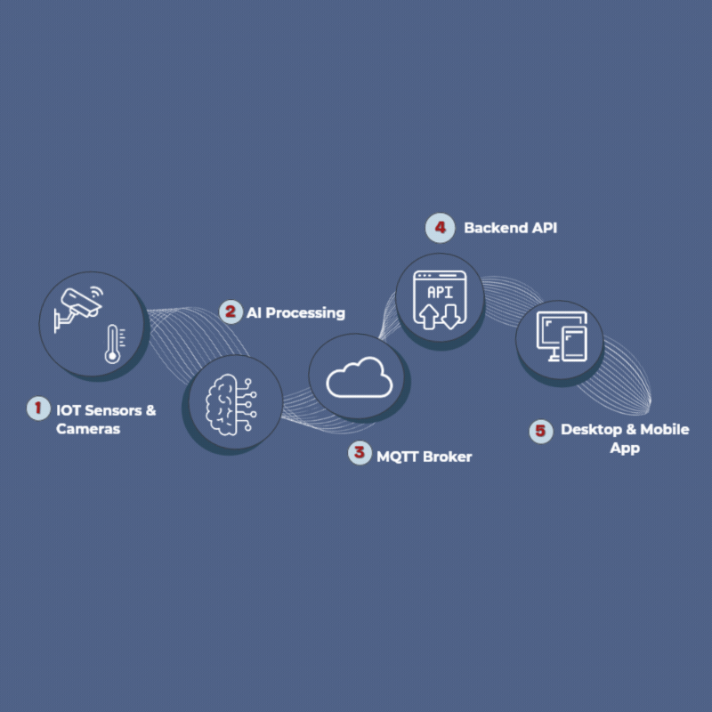

<div align="center">

# RaSed — Backend API
### Integrated Security, Safety & Monitoring System

[](https://dotnet.microsoft.com)
[](https://www.postgresql.org)
[](https://dotnet.microsoft.com/en-us/apps/aspnet/signaling)
[](https://mqtt.org)
[](https://firebase.google.com/docs/cloud-messaging)
[](https://cloudinary.com)
[](https://documenter.getpostman.com/view/YOUR_LINK)

---
</div>

## Overview

This repository contains the **backend API** for the RaSed system — a .NET 9 REST API
that serves as the central nervous system of the platform, bridging IoT sensor data,
AI-powered detections, and real-time communication across both mobile and desktop clients.

The API handles all business logic and data persistence, maintains a persistent connection
with the MQTT broker to receive and process live sensor events, integrates with AI detection
services for automated threat analysis, exposes SignalR hubs for real-time data streaming,
and delivers push notifications via Firebase Cloud Messaging.

---


## System Architecture

<div align="center">
  
</div>

---

## Table of Contents

| # | Section |
|---|---|
| 1 | [Overview](#overview) |
| 2 | [System Architecture](#system-architecture) |
| 3 | [Prerequisites](#prerequisites) |
| 4 | [Getting Started](#getting-started) |
| 5 | [Environment Variables](#environment-variables) |
| 6 | [Authentication & Authorization](#authentication--authorization) |
| 7 | [API Documentation](#api-documentation) |
| 8 | [Project Structure](#project-structure) |
| 9 | [Tech Stack](#tech-stack) |

---

## Prerequisites
 
Install the following on your machine before running the project:
 
| Requirement | Version | Notes |
|---|---|---|
| [.NET SDK](https://dotnet.microsoft.com/download) | **9.0+** | Required |
| [PostgreSQL](https://www.postgresql.org/download/) | **16+** | Primary database |
| [EF Core CLI](https://learn.microsoft.com/ef/core/cli/dotnet) | **9.0+** | Run: `dotnet tool install -g dotnet-ef` |
| [Visual Studio](https://visualstudio.microsoft.com/) | **2022+** | Or VS Code + C# Dev Kit extension |
| [Postman](https://www.postman.com/) | Latest | For testing the API (optional) |
 
---

## Getting Started

### 1. Clone the Repository

```bash
git clone https://github.com/rased-360/Backend.git
cd rased-api
```
### 2. Configure Environment

```bash
cp appsettings-template.json appsettings.json
```

Open `appsettings.json` and fill in all required values — see [Environment Variables](#environment-variables) for details.
> ⚠️ `appsettings.json` is in `.gitignore` and must **never** be committed.

### 3. Restore Dependencies

```bash
dotnet restore
```

### 4. Apply Database Migrations

```bash
dotnet ef database update --project src/RaSed.Infrastructure --startup-project src/RaSed.API
```

### 5. Run the Application

```bash
dotnet run --project src/RaSed.API
```


### Default SuperAdmin Account

On first run, the application **automatically seeds** a SuperAdmin account and all roles (`SuperAdmin`, `Admin`, `Employee`).
| Field | Value |
|---|---|
| Email | `superadmin@factory.com` |
| Password | `Super@1234` |
| Role | `SuperAdmin` |

> ⚠️ **Change the default password immediately** after first login in a production environment.
This account is used to log in to the **Desktop application** and create all other Admin and Employee accounts. No registration endpoint exists — all accounts are managed by the SuperAdmin.
--

---

## Environment Variables

Copy `appsettings-template.json` → `appsettings.json` and fill in every key below.

### Database

| Key | Description | Example |
|---|---|---|
| `ConnectionStrings:DefaultConnection` | PostgreSQL connection string | `Host=localhost;Port=5432;Database=RaSedDb;Username=postgres;Password=yourpassword` |

### JWT Authentication

| Key | Description | Example |
|---|---|---|
| `JWT:Key` | Secret key for signing JWT tokens (minimum 32 characters) | `your-very-secret-key-32chars-min` |
| `JWT:issuer` | Token issuer (usually your API URL) | `https://rasedapi.runasp.net` |
| `JWT:audience` | Token audience (your client apps) | `RaSedApp` |

### MQTT (Sensor Communication)

Used to receive real-time data from factory sensors via an MQTT broker.

| Key | Description | Example |
|---|---|---|
| `MqttSettings:Broker` | MQTT broker host address | `YOUR_BROKER` |
| `MqttSettings:Port` | MQTT broker port | `1883` |
| `MqttSettings:DeviceId` | Unique device identifier | `rased-device-01` |
| `MqttSettings:ClientIdPrefix` | Prefix for MQTT client IDs | `rased-api` |

### Email (OTP)

Used to send OTP codes for password reset.

| Key | Description | Example |
|---|---|---|
| `EmailSettings:SmtpHost` | SMTP server host | `smtp.gmail.com` |
| `EmailSettings:SmtpPort` | SMTP server port | `587` |
| `EmailSettings:SmtpUser` | SMTP System account email | `your-email@gmail.com` |
| `EmailSettings:SmtpPassword` | SMTP account password or App Password | `your-app-password` |
| `EmailSettings:FromName` | Display name for sent emails | `RaSed` |

> 💡 For Gmail: enable 2FA and use an [App Password](https://myaccount.google.com/apppasswords) instead of your main password.

### Cloudinary (Media Uploads)

Used for uploading and managing profile photos and media files.

| Key | Description | Where to find |
|---|---|---|
| `Cloudinary:CloudName` | Your Cloudinary cloud name | [Cloudinary Dashboard](https://cloudinary.com/console) |
| `Cloudinary:ApiKey` | Cloudinary API key | Cloudinary Dashboard |
| `Cloudinary:ApiSecret` | Cloudinary API secret | Cloudinary Dashboard |

### Firebase (Push Notifications)

Used to send push notifications to the Mobile app (Employee).

| Key | Description | Where to find |
|---|---|---|
| Firebase config | Service account JSON file | [Firebase Console](https://console.firebase.google.com/) → Project Settings → Service Accounts |

> 💡 Place your Firebase service account JSON file in the project root and reference it in the configuration as per your setup.

### OTP Settings

Controls OTP behavior for password reset.

| Key | Description | Default |
|---|---|---|
| `OtpSetting:ExpiryMinutes` | OTP validity duration in minutes | `5` |
| `OtpSetting:MaxLongTermAttempts` | Max total OTP requests allowed | `5` |
| `OtpSetting:ResendDelayMinutes` | Minimum wait between OTP resends (minutes) | `1` |
| `OtpSetting:MaxFailedAttempts` | Max failed verification attempts before block | `3` |

### Violation Cleanup (Background Job)

Controls automatic cleanup of old violation records.

| Key | Description | Default |
|---|---|---|
| `ViolationCleanup:RetentionDays` | Days to keep violation records before deletion | `60` |
| `ViolationCleanup:IntervalHours` | How often the cleanup job runs | `24` |

### Performance Settings

Controls employee performance scoring calculation.

| Key | Description | Default |
|---|---|---|
| `PerformanceSettings:WindowDays` | Evaluation period in days | `30` |
| `PerformanceSettings:PenaltyPerViolation` | Score points deducted per violation | `10` |


---


## Authentication & Authorization
 
RaSed uses **JWT Bearer Tokens** with **Refresh Token** rotation. There are two separate authentication flows depending on the client:
 
| Client | Login Endpoint | Refresh | Logout | Revoke |
|---|---|---|---|---|
| 🖥️ Desktop (Admin, SuperAdmin) | `POST /api/admin/auth/login` | `POST /api/admin/auth/refresh-token` | `POST /api/admin/auth/logout` | `POST /api/admin/auth/revoke-token` |
| 📱 Mobile (Employee) | `POST /api/employee/auth/login` | `POST /api/employee/auth/refresh-token` | `POST /api/employee/auth/logout` | `POST /api/employee/auth/revoke-token` |
 
 
### Using the Token
 
After login, include the returned token in every protected request:
 
```http
Authorization: Bearer <access_token>
```
 
### Roles & Access
 
| Role | Description | Client |
|---|---|---|
| `SuperAdmin` | Manages Admins and Employee accounts | Desktop |
| `Admin` | Manages Employees, Sensor Dashboard, Violations, and Reports | Desktop |
| `Employee` | Views own data, reports issues, sends SOS, receives violation notifications | Mobile |
 
### Security Rules
 
| Rule | Detail |
|---|---|
| **Password policy** | Min 8 chars · uppercase · lowercase · digit · special character |
| **Account lockout** | Locked for **5 minutes** after **5** failed login attempts |
| **Rate limiting** | Max **5 login requests / minute / IP** — returns `429 Too Many Requests` |
 
---

## API Documentation


---

## Project Structure


---

## Tech Stack
